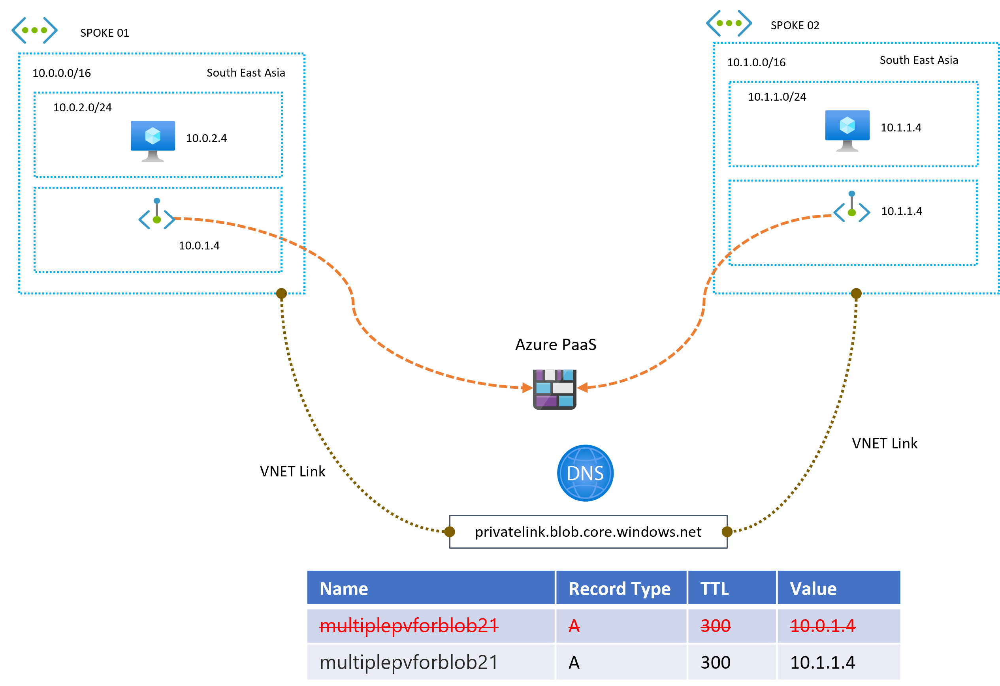
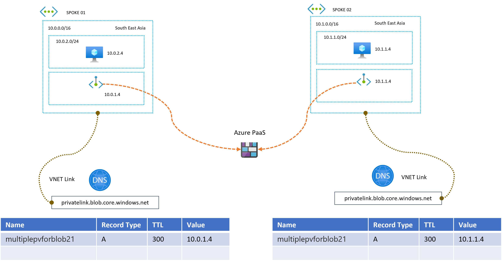
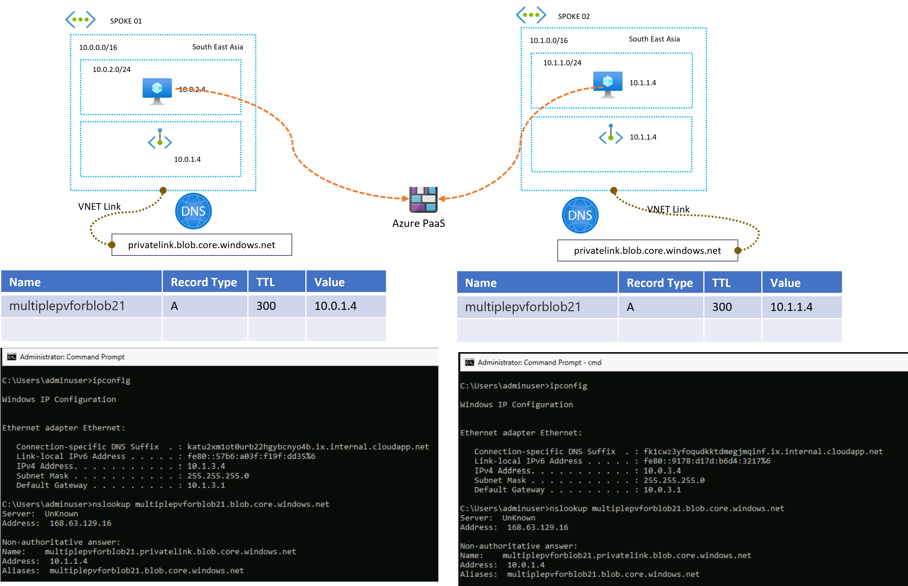

## Can I Have Multiple Private Endpoints for the Same Blob Storage in the Same Region?

Recently, a customer requested to access a storage account via a private endpoint, but with a twist—they needed multiple private endpoints for the same storage account. This raised the question: Is it possible to have multiple private endpoints for the same Blob Storage in the same region, and how do you manage the DNS records for each of them?

### What is a Private Endpoint?

### 1. Private Endpoint Overview

A private endpoint allows secure access to Azure services from within a VNet (Virtual Network) without exposing the service to the public internet. Private endpoints can be created for many Azure services, such as Azure Storage (Blob, File, Queue, and Table), Azure SQL Database, and more.

For Azure Blob Storage, a private endpoint maps a network interface (NIC) to the storage account, which enables secure access from a VNet to the storage service.

### 2. Multiple Private Endpoints for the Same Blob Storage

It is possible to create multiple private endpoints for the same blob storage account, but each private endpoint must be associated with a different VNet. This allows multiple VNets to securely access the same Azure Blob Storage service.

However, when multiple private endpoints are created, they all attempt to register DNS records in the same Private DNS Zone (e.g., `privatelink.blob.core.windows.net`). This can cause challenges, as DNS A records must have unique names within the same DNS zone. Consequently, DNS records for the private endpoints can conflict and overwrite each other if they share the same name.

Azure Private DNS does not natively support subdomains like traditional public DNS for private endpoints. In Azure Private DNS zones, you're restricted to predefined service-specific DNS zones (like `privatelink.blob.core.windows.net`). Therefore, using custom subdomains (`vnet1.multiplepvforblob21.privatelink.blob.core.windows.net`) to differentiate between private endpoints does not work in the same way as public DNS.

## Azure Private Endpoint and FQDN for Private DNS Zones

When creating multiple private endpoints for the same service, such as a storage account, each private endpoint will be registered in a **Private DNS Zone** with a **Fully Qualified Domain Name (FQDN)** that is specific to Azure services. For example, for Blob storage, the FQDN will be `*.blob.core.windows.net`.

In this case, when you create a private endpoint for your storage account, Azure creates an A record in the private DNS zone (`privatelink.blob.core.windows.net`), mapping to the private IP address of the endpoint. The FQDN will look something like `multiplepvforblob21.blob.core.windows.net`.

### Challenge with Multiple Private Endpoints for the Same Blob Storage

When creating multiple private endpoints for the same storage account across different VNets, both private endpoints will try to register the same DNS name (`multiplepvforblob21.blob.core.windows.net`) in the private DNS zone (`privatelink.blob.core.windows.net`). Since the DNS A record can only map to one private IP address, the most recent private endpoint registration will overwrite the previous one.

### How to Overcome the Challenges and Provide Multiple Private Endpoints for the Same Blob Storage

To overcome the challenge of DNS record conflicts, you can utilize multiple private DNS zones and customize the DNS structure for each VNet. This way, each VNet can resolve the private endpoint independently. Here's how you can achieve this:

### Solution Steps

1. **Create a Storage Account:**
   - Create a storage account called `multiplepvforblob21`.

2. **Create Two VNets:**
   - Create two VNets (VNet1 and VNet2) in different address spaces.
   
3. **Create Private DNS Zones:**
   - Create two separate private DNS zones. 
     - Vnet 1 Resource Group - place Azure-managed DNS zone (`privatelink.blob.core.windows.net`)
     - Vnet 2 Resource Group - place Azure-managed DNS zone (`privatelink.blob.core.windows.net`)

4. **Create Private Endpoints:**
   - Create two private endpoints, each associated with one of the VNets, and point them to the storage account `multiplepvforblob21`.

5. **Create VNet Links:**
   - Link each VNet to its respective DNS zone:
     - VNet1 is linked to the Azure-managed DNS zone (`privatelink.blob.core.windows.net`).
     - VNet2 is linked to the Azure-managed DNS zone (`privatelink.blob.core.windows.net`).

### Explanation of the Solution

1. **Two VNets with Separate Subnets:** We create two VNets (`vnet1` and `vnet2`), each in its own address space, so that they can access the storage account using different private endpoints.
  
2. **DNS Zones:** We create two DNS zones, one for each VNet. VNet1 uses the default Azure Private DNS zone (`privatelink.blob.core.windows.net`), while VNet2 uses another Azure Private DNS zone(`privatelink.blob.core.windows.net`).
  
3. **Private Endpoints:** Two private endpoints are created, each one associated with a different VNet, and linked to the storage account `multiplepvforblob21`.
  
4. **DNS Records:** Automatically we add A records in the DNS zones, ensuring that each VNet resolves to the correct private endpoint IP address. This avoids the issue of DNS records overwriting each other.

This setup allows both VNets to access the same storage account through different private endpoints without conflicting DNS entries.

### Final outcome

